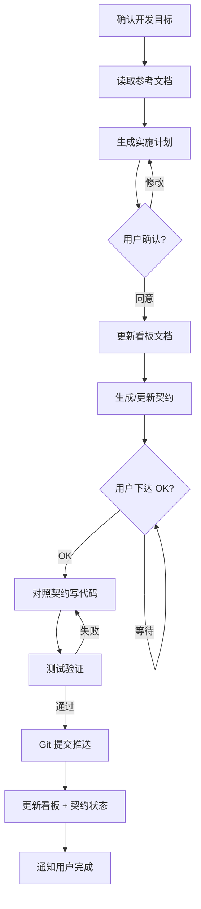

# /dev-module 模块开发工作流

> ⚠️ **核心原则**：先规划、先文档、后写码。每一步都需要用户确认后才能进入下一阶段。

---

## 阶段一：规划与确认

### 1. 确认开发目标

向用户确认要开发或修改的模块名称、需求范围。

### 2. 读取参考文档

// turbo
读取以下文件获取上下文：
- `技术方案与系统架构设计.md` — 系统总体架构与功能设计
- `docs/contracts/{module_id}.contract.md` — 已有契约（如存在）
- `docs/artifacts/walkthrough.md` — 项目进度看板
- `docs/artifacts/task.md` — 任务清单
- `.agents/rules/` — 团队技术规范

### 3. 生成实施计划

创建 `implementation_plan.md`，包含：
- 要修改/新增的内容概述
- 涉及的后端文件（Model / Service / Router）
- 涉及的前端文件（Page / Components / API Client）
- 数据模型变更（如有）
- API 接口变更
- 前端页面变更
- 测试验证方案

**⏸️ 暂停，提交给用户审阅，等待用户确认。**

---

## 阶段二：文档同步

用户确认实施计划后，执行以下操作：

### 4. 更新项目看板

将本次新增/修改的功能提炼，更新到 `docs/artifacts/walkthrough.md` 和 `docs/artifacts/task.md`。

### 5. 生成或更新开发契约

按 `docs/contracts/` 目录下已有契约格式，生成或更新 `docs/contracts/{module_id}.contract.md`：
- 新模块：创建完整契约
- 修改功能：更新契约中受影响的部分

**⏸️ 暂停，等待用户下达 "OK" 指令后，才能进入代码编写阶段。**

---

## 阶段三：代码开发

收到用户 "OK" 指令后，开始编写代码。

### 6. 对照契约开发

**只参考契约文件** + `.agents/rules/` 技术规范，不需要重新阅读全部文档。

开发顺序：
1. 后端 Model（数据模型 / 数据库迁移）
2. 后端 Service（业务逻辑）
3. 后端 Router（API 接口）
4. 前端页面（遵循 shadcn/ui + Tailwind 规范）

---

## 阶段四：测试验证

### 7. 测试

- 后端 API 通过 pytest 或 curl 测试
- 前端页面功能正常
- Docker 容器内验证

```bash
# 后端测试
docker exec excavation-api pytest tests/ -v --tb=short

# 重建前端
docker compose build --no-cache web && docker compose up -d web
```

---

## 阶段五：提交

### 8. Git 提交

// turbo
```bash
cd /Users/imac2026/Desktop/掘进工作面规程智能生成平台
git add -A && git commit -m "feat(MODULE): 模块描述" && git push origin main
```

### 9. 更新看板

// turbo
更新 `docs/artifacts/walkthrough.md` 和 `docs/artifacts/task.md`。

---

## 流程图


