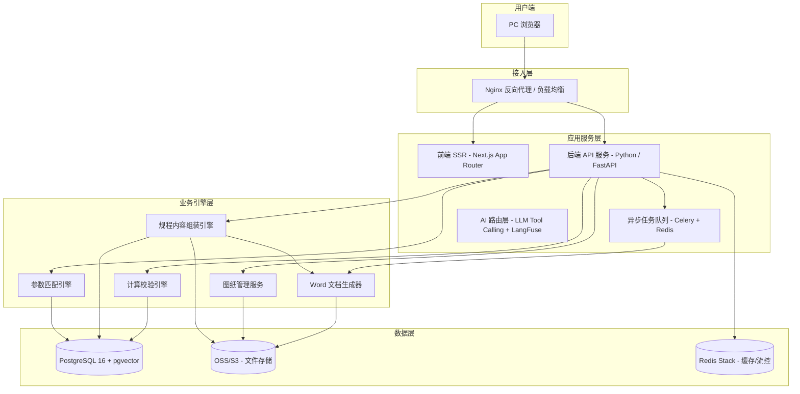
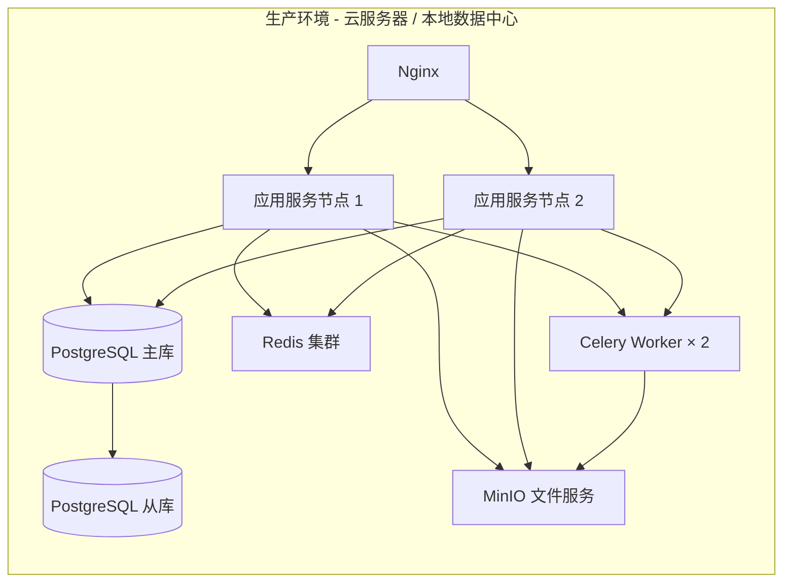
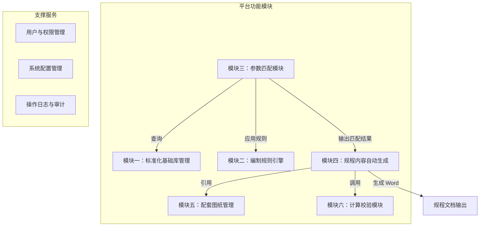
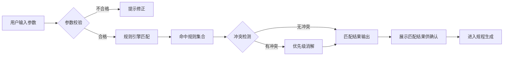
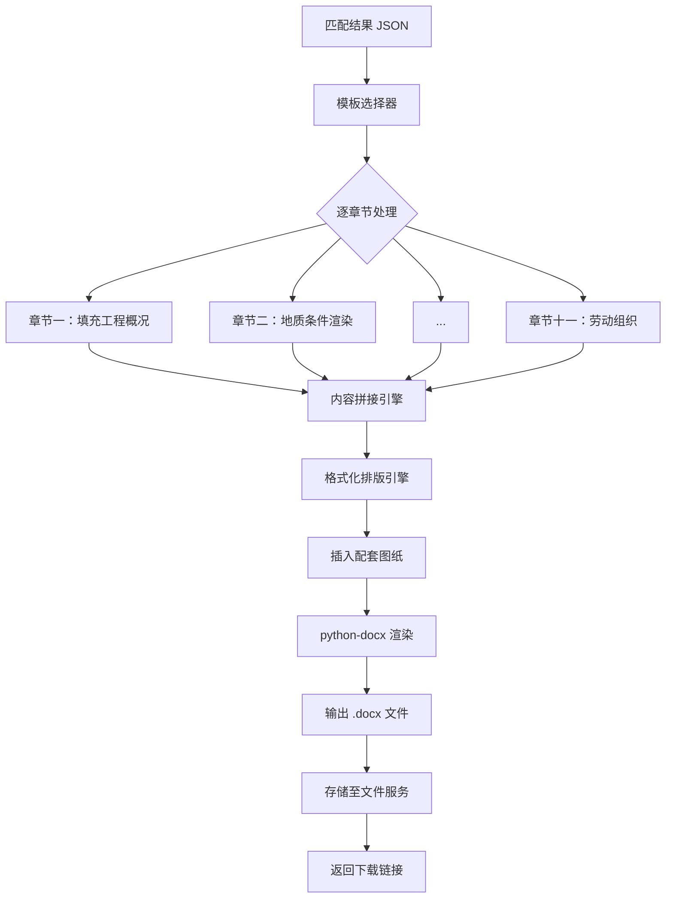
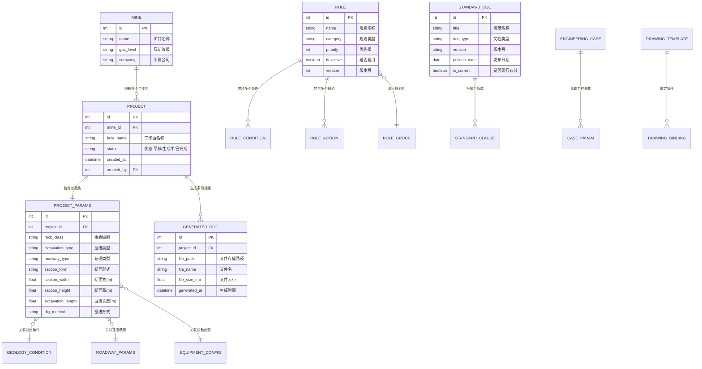
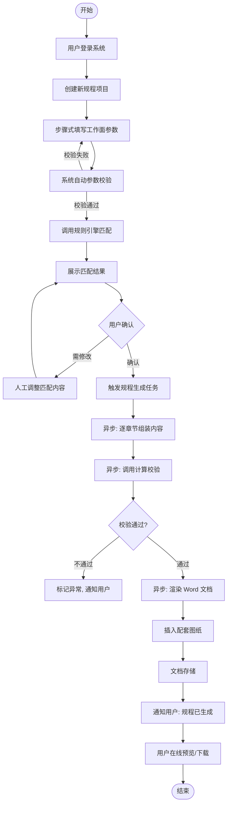
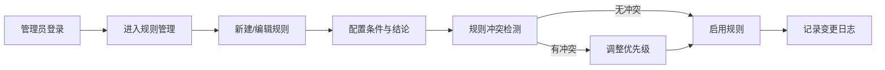
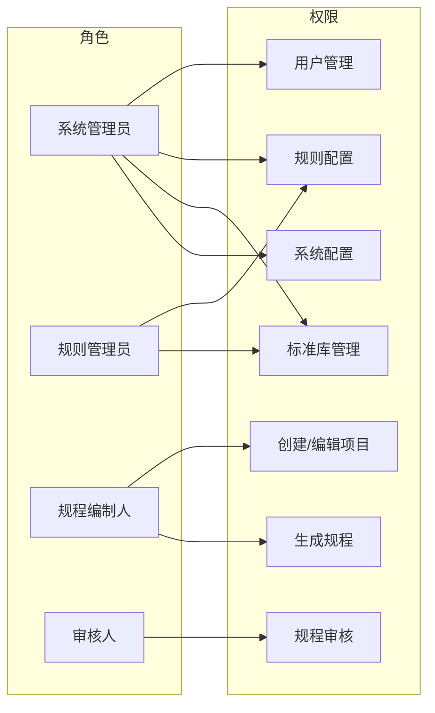
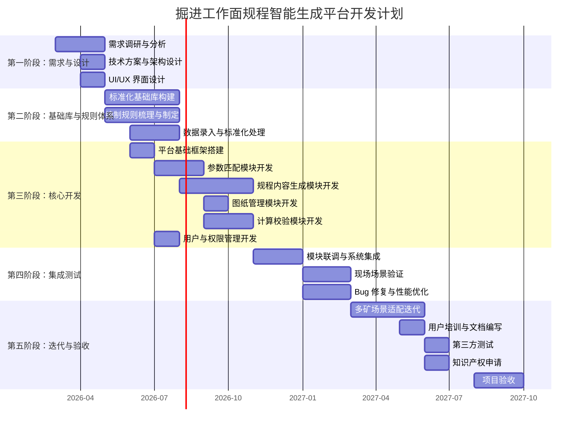

# 煤矿掘进工作面规程智能生成平台 — 技术方案与系统架构设计

> **版本**：V2.0（依据团队统一技术规范修订） &nbsp;|&nbsp; **编制日期**：2026-03-17  
> **项目主体**：山西国辰建设工程勘察设计有限公司  
> **技术协作**：山西工程技术学院  

---

## 目录

1. [项目概述](#1-项目概述)
2. [系统总体架构](#2-系统总体架构)
3. [技术选型](#3-技术选型)
4. [功能模块详细设计](#4-功能模块详细设计)
5. [数据模型与数据库设计](#5-数据模型与数据库设计)
6. [核心业务流程](#6-核心业务流程)
7. [接口设计（API 规范）](#7-接口设计api-规范)
8. [安全与权限设计](#8-安全与权限设计)
9. [部署方案与运维](#9-部署方案与运维)
10. [项目里程碑与开发排期](#10-项目里程碑与开发排期)

---

## 1. 项目概述

### 1.1 项目背景

华阳集团所属矿井掘进工作面作业规程编制工作仍采用依赖技术人员个人经验判断、手工编写整理的传统模式，存在以下核心问题：

| 问题维度 | 现状描述 |
|---------|---------|
| **编制效率** | 单份规程平均耗时 15 天，复杂地质条件下需反复核对，严重影响采掘衔接进度 |
| **规范一致性** | 不同矿、不同技术人员编制的规程在术语、参数格式、安全措施等方面差异大 |
| **安全防控** | 依赖个人经验易因研判偏差导致安全技术措施针对性不足 |
| **知识传承** | 优秀经验多为"口传心授"，核心人员流失造成技术断层 |

### 1.2 项目目标

开发一套**煤矿掘进工作面作业规程自动生成平台**，实现：

```
现场参数选择 → 标准库匹配 → 规程内容自动拼接 → Word 文档输出
```

**核心指标**：
- 规程编制周期由 **15 天 → 10 天**，效率提升 **≥30%**
- 支持 **煤巷、岩巷、半煤岩巷** 全类型掘进工作面
- 输出规程符合国家/行业/集团标准规范

### 1.3 建设范围（本期）

本期聚焦 **掘进工作面作业规程** 专项模块，平台整体框架预留全规程扩展接口（回采、运输、通风、机电、防突等）。

---

## 2. 系统总体架构

### 2.1 逻辑分层架构

系统采用经典 **四层架构**，各层职责清晰、松耦合：

```
┌─────────────────────────────────────────────────────────────────┐
│                     展示层（Presentation）                       │
│  Web 前端（PC 浏览器）  ·  响应式 UI  ·  参数表单  ·  预览渲染    │
├─────────────────────────────────────────────────────────────────┤
│                     应用层（Application）                        │
│  API 网关  ·  用户认证  ·  业务编排  ·  缓存  ·  任务队列         │
├─────────────────────────────────────────────────────────────────┤
│                     业务逻辑层（Domain）                         │
│  参数匹配引擎 · 规程内容组装引擎 · 计算校验引擎 · 图纸管理服务     │
├─────────────────────────────────────────────────────────────────┤
│                     数据层（Data）                               │
│  关系数据库  ·  文件存储（图纸/模板/输出文档）  ·  缓存/搜索引擎    │
└─────────────────────────────────────────────────────────────────┘
```

### 2.2 系统架构总览



### 2.3 部署架构



> **部署模式**：支持 **云服务器部署**（推荐）与 **本地数据中心部署** 两种模式，通过 Docker Compose / Kubernetes 统一编排。

---

## 3. 技术选型

> [!NOTE]
> 本章技术选型严格遵循团队统一技术规范（EmptyProject 仓库 `.agents/rules/`），确保多项目技术栈一致性。

### 3.1 技术栈总览

| 层级 | 技术组件 | 选型方案 | 选型理由 / 规范依据 |
|------|---------|---------|---------|
| **前端** | 框架 | **Next.js (App Router) + TypeScript** | 团队规范强制要求，SSR/SSG、RSC 支持 |
| | UI 组件 | **shadcn/ui + Tailwind CSS** | 规范指定，高度可定制、无运行时开销 |
| | 状态管理 | **Zustand** | 轻量、TypeScript 原生、无 boilerplate |
| | 数据请求 | **TanStack Query (React Query)** | 自动缓存失效、乐观更新、服务端状态管理 |
| | 数据表格 | **TanStack Table** | 高性能虚拟化表格，适合规则/案例管理 |
| | 图表 | **Recharts** | 规范指定，用于计算校验结果可视化 |
| | 文档预览 | **docx-preview / Mammoth.js** | 浏览器端 Word 在线预览 |
| **后端** | Web 框架 | **Python 3.11+ / FastAPI + Uvicorn** | 规范强制，严格 async/await 异步编程 |
| | 数据校验 | **Pydantic V2** | 规范强制，所有 API 必须 Pydantic 校验 |
| | ORM | **SQLAlchemy 2.0 (async)** | 异步 ORM，与 FastAPI 配合最佳 |
| | 任务队列 | **Celery + Redis** | 文档生成等耗时任务异步处理 |
| | 文档生成 | **python-docx** | Word .docx 程序化生成与模板渲染 |
| | 测试 | **pytest + pytest-asyncio + httpx** | 规范强制，路由测试用 httpx.AsyncClient |
| **AI 层** | 意图路由 | **LLM Tool Calling / LangGraph** | 规范禁止硬编码 if-else，复杂业务交由 LLM 路由 |
| | 模型选择 | **动态选择器 (LLMSelector)** | 规范禁止硬编码模型名，统一 `llm_registry.yaml` 配置 |
| | 数据飞轮 | **LangFuse** | 规范强制接入，高质量输出标记 `quality: high` 积累 SFT 语料 |
| | 检索流水线 | **pgvector → 递归 CTE → SQL → LLM** | 规范强制三层检索，严禁全量灌入 Prompt |
| **数据库** | 关系数据库 | **PostgreSQL 16** | 规范强制版本，JSONB + 全文检索 + pgvector |
| | 向量存储 | **pgvector (HNSW 索引)** | 规范要求弃用外部独立向量库，知识库表含 `embedding Vector(1536)` |
| | 缓存/流控 | **Redis Stack** | 高频查询缓存 + WebSocket 状态同步 + 消息队列 |
| | 文件存储 | **OSS/S3** | 规范要求二进制零入库，图片/文档直传 OSS，DB 仅存 URL |
| **运维** | 容器化 | **Docker + Docker Compose** | 标准化部署、环境一致性 |
| | 反向代理 | **Nginx** | 静态资源托管、负载均衡、HTTPS |
| | 监控 | **Prometheus + Grafana** | 开源、可视化监控告警 |

### 3.2 核心架构红线（团队规范）

以下为团队统一技术规范中的 **不可违反底线**：

| # | 红线事项 | 说明 |
|---|---------|------|
| 1 | **密钥安全** | 严禁客户端暴露 API Key / 数据库连接串，必须后端中转 + `.env` |
| 2 | **二进制零入库** | 图片/音频/文档直传 OSS/S3，PostgreSQL 仅存 URL/Key |
| 3 | **强制权限隔离** | 所有查询必须注入 `tenant_id` 过滤（本项目按矿井隔离） |
| 4 | **意图路由** | 复杂业务流转交 LLM Tool Calling，严禁硬编码 if-else |
| 5 | **通信协议** | 单向流式用 SSE；双向高频用 WebSocket + Redis Pub/Sub |
| 6 | **Git 规范** | Conventional Commits (`feat/fix/docs/refactor/test`) |
| 7 | **测试底线** | 单元测试禁止真实 LLM/OSS 调用，必须 Mock |
| 8 | **通用字段** | 所有核心表必须含 `created_at, updated_at, created_by, tenant_id` |
| 9 | **多租户 RAG 强制隔离** | 所有 RAG/检索类 Service 单例或函数，必须强制带入 `tenant_id`，禁止全域检索 |
| 10| **生成结果人工标注闭环** | 生成的规程必须支持前端在线 Edit，并将用户修改的 Diff 保存反馈回流，构成大模型自进化的数据飞轮 |
| 11| **LLM 质量网关（Guardrails）** | 大模型如果输出安全参数，必须有传统计算引擎二次兜底反校，阻断幻觉 |

### 3.3 技术选型说明

> [!IMPORTANT]
> **为什么选 Python / FastAPI 而非 Java / Spring Boot？**
> 1. 本项目核心是 **规则匹配 + 文档生成**，Python 在文本处理（python-docx）、科学计算（numpy/scipy）生态上远优于 Java
> 2. FastAPI 性能接近 Go/Node.js（async/await + uvicorn），远超 Flask/Django
> 3. 后续 AI 智能路由（LLM Tool Calling + LangGraph）、向量检索（pgvector）均为 Python 原生生态
> 4. 团队统一技术规范已锁定此选型

> [!IMPORTANT]
> **为什么前端选 Next.js 而非 Vue 3？**
> 1. 团队统一技术规范强制要求 Next.js App Router + TypeScript
> 2. React Server Components (RSC) 可将规程预览等重渲染逻辑移至服务端，降低客户端负担
> 3. shadcn/ui + Tailwind CSS 组件化程度高，适合快速搭建企业级管理后台
> 4. TanStack Query 对服务端状态管理（规则列表、项目列表等）有天然优势

---

## 4. 功能模块详细设计

### 4.0 模块总览



---

### 4.1 模块一：掘进专业标准化基础库管理

**目标**：构建覆盖政策规范与工程实践的 **双层标准化基础库**。

#### 4.1.1 规范标准库

管理国家/行业/集团层面的掘进相关法律法规、技术规范和安全规程。

| 数据类别 | 典型内容示例 |
|---------|-------------|
| 法律法规 | 《煤矿安全规程》《煤炭法》 |
| 技术规范 | 《煤矿巷道锚杆支护技术规范》《煤矿围岩分类》 |
| 集团标准 | 华阳集团内部技术管理规定、掘进相关补充条款 |
| 安全规程 | 瓦斯管理、防尘、防水、顶板管理等专项规定 |

**功能点**：
- 规范文档的 **分类管理**（按类型/适用范围/发布时间）
- 条款级别的 **结构化拆解与存储**（标题→章→节→条款→关键参数）
- **版本控制**（规范更新时保留历史版本，标记差异）
- **全文检索**（基于 PostgreSQL TSVECTOR 或 Elasticsearch）

#### 4.1.2 工程资料库

整理集团各矿历史掘进工程资料。

| 数据类别 | 内容 |
|---------|------|
| 设计图纸 | 巷道断面图、支护设计图、设备布置图 |
| 审批规程 | 历史已审批通过的掘进作业规程（Word/PDF） |
| 矿压数据 | 矿压监测报告、围岩变形观测数据 |
| 支护记录 | 锚杆/锚索施工记录、支护参数统计 |
| 设备说明 | 掘进设备技术参数手册 |

#### 4.1.3 典型案例库

筛选不同围岩条件、煤层厚度及掘进类型的典型工程案例，标注关键参数供匹配引用。

---

### 4.2 模块二：数据标准化与编制规则引擎

**目标**：将专家经验、行业规范转化为可执行的参数化匹配规则。

#### 4.2.1 数据标准化

| 标准化维度 | 描述 |
|-----------|------|
| 术语统一 | 建立掘进专业术语表，统一不同矿的表述差异 |
| 参数格式 | 巷道断面 → "宽×高"(m)，支护间距 → 米制，循环进尺 → 统一计量 |
| 异常剔除 | 识别并剔除工程资料中支护参数、矿压数据的异常值 |
| 缺失补全 | 关键参数缺失时标记并提供默认推荐值 |

#### 4.2.2 编制规则体系

核心匹配规则采用 **"条件 → 结论"** 的规则引擎模式：

```
规则格式：
IF  条件集合（地质条件 ∧ 掘进参数 ∧ 矿井灾害等级 ∧ ...）
THEN 规程内容片段（支护参数 / 装备选型 / 安全措施 / ...）
PRIORITY 优先级（当多条规则匹配时的冲突消解策略）
```

**规则分类**：

| 规则类型 | 映射关系 | 示例 |
|---------|---------|------|
| 支护规则 | 围岩级别 → 支护参数 | Ⅲ类围岩 → 锚杆间距 800×800mm、锚索排距 1600mm |
| 装备规则 | 掘进类型 → 装备选型 | 煤巷综掘 → EBZ200 型掘进机 |
| 安全规则 | 灾害等级 → 安全措施 | 高瓦斯矿井 → 瓦斯检查制度 + 专用措施条款 |
| 断面规则 | 巷道用途 → 断面设计 | 进风巷 → 矩形断面 5.0m×3.6m |
| 通风规则 | 巷道参数 → 通风量 | 掘进长度 + 断面 → 最小风量计算 |

**规则管理功能**：
- 以可视化表单（非代码方式）配置规则的条件与结论
- 规则的启用/禁用、版本管理
- 规则冲突检测与优先级调整
- 规则变更审计日志

---

### 4.3 模块三：掘进工作面参数匹配模块

**目标**：提供可视化交互界面，支持现场技术人员快速录入参数，系统自动匹配模板与内容片段。

#### 4.3.1 参数输入界面

按 **分步表单（Wizard）** 模式组织，降低用户一次性填写压力：

```
步骤 1：矿井基本信息
  ├── 矿井名称（下拉选择）
  ├── 工作面名称
  └── 编制日期

步骤 2：地质条件
  ├── 围岩级别（Ⅰ/Ⅱ/Ⅲ/Ⅳ/Ⅴ 类）
  ├── 煤层厚度（m）
  ├── 煤层倾角（°）
  ├── 瓦斯等级（低/高/突出）
  ├── 水文地质类型
  ├── 地质构造特征（断层/褶曲/陷落柱等）
  └── 自燃倾向性

步骤 3：巷道参数
  ├── 巷道类型（进风巷/回风巷/高抽巷/低抽巷/切巷）
  ├── 掘进类型（煤巷/岩巷/半煤岩巷）
  ├── 断面形式（矩形/拱形/梯形）
  ├── 设计断面尺寸（宽×高 m）
  ├── 掘进长度（m）
  └── 服务年限

步骤 4：设备配置
  ├── 掘进方式（综掘/炮掘/手工掘进）
  ├── 掘进设备型号
  ├── 运输方式
  └── 辅助设备

步骤 5：确认与提交
  └── 参数汇总 → 确认提交
```

#### 4.3.2 匹配逻辑



---

### 4.4 模块四：掘进作业规程内容自动生成模块

**目标**：根据参数匹配结果，自动生成标准化掘进作业规程 Word 文档。

#### 4.4.1 规程章节框架

系统按以下标准化章节框架组装规程：

| 章节序号 | 章节名称 | 内容来源 |
|---------|---------|---------|
| 第一章 | 工程概况 | 用户输入参数 + 地质资料模板 |
| 第二章 | 地质条件 | 基础库匹配 + 用户补充 |
| 第三章 | 巷道断面设计 | 规则引擎 + 参数计算 |
| 第四章 | 掘进施工工艺 | 规则引擎（掘进类型→工艺） |
| 第五章 | 支护设计 | 规则引擎 + 计算校验模块 |
| 第六章 | 正规循环作业 | 规则引擎（设备/工序→循环表） |
| 第七章 | 通风与瓦斯管理 | 规则引擎 + 通风量计算 |
| 第八章 | 安全技术措施 | 灾害等级→安全措施规则 |
| 第九章 | 灾害预防与处理 | 灾害类型→预案模板 |
| 第十章 | 避灾路线 | 图纸管理模块引用 |
| 第十一章 | 劳动组织 | 通用模板 + 人员配置 |
| 附图 | 配套工程图纸 | 图纸管理模块 |

#### 4.4.2 文档生成引擎



**技术实现要点**：
- 使用 **python-docx** 基于 Word 模板（.docx）进行 **"邮件合并"式** 内容填充
- 每个章节对应一个 **Jinja2 模板片段**，支持条件渲染（如高瓦斯矿井额外插入瓦斯管理章节）
- 表格（如支护参数表、循环作业表）程序化生成
- 异步处理：文档生成通过 **Celery 任务队列** 异步执行，前端轮询进度

---

### 4.5 模块五：配套图纸统一管理模块

**目标**：统一管理掘进作业规程所需的各类工程图纸模板。

#### 4.5.1 图纸分类

| 分类 | 图纸类型 |
|------|---------|
| 断面图 | 巷道断面设计图（矩形/拱形/梯形） |
| 支护图 | 锚杆锚索布置图、支护断面图、交岔点支护图 |
| 布置图 | 设备布置图、通风系统布置图 |
| 作业图表 | 正规循环作业图表 |
| 安全图 | 避灾路线图 |

#### 4.5.2 功能设计

- **图纸上传**：支持 DWG / PDF / PNG / JPG 格式
- **智能关联**：图纸可绑定到特定围岩/断面/巷道类型条件，参数匹配时自动推荐
- **版本管理**：同一类图纸支持多版本，标记当前有效版本
- **在线预览**：浏览器端预览 PDF/图片格式图纸
- **批量导出**：规程生成时自动将关联图纸作为附图插入或打包

---

### 4.6 模块六：关键计算校验模块

**目标**：嵌入标准化计算公式，自动完成关键数值的计算与合规性校验。

#### 4.6.1 计算模块清单

| 计算项目 | 计算依据 | 输入参数 | 输出结果 |
|---------|---------|---------|---------|
| **锚杆支护强度** | 悬吊理论 / 组合梁理论 | 围岩级别、巷道尺寸、锚杆参数 | 锚杆承载力、安全系数 |
| **锚索受力计算** | 锚索设计规范 | 锚索长度、直径、锚固段 | 设计载荷、安全余量 |
| **通风量计算** | 《煤矿安全规程》 | 巷道断面、掘进长度、瓦斯涌出量 | 需风量(m³/min)、风速校验 |
| **风阻计算** | 通风网络理论 | 巷道长度、断面、粗糙系数 | 通风阻力 |
| **掘进工效** | 循环作业标准 | 掘进方式、设备参数 | 循环进度、月进尺 |

#### 4.6.2 校验逻辑

```
计算结果 → 与规范限值比对 → 生成校验报告
  ├── ✅ 合格 → 直接写入规程
  ├── ⚠️ 临界 → 标黄警告，提示人工复核
  └── ❌ 不合格 → 阻断生成，提示参数调整建议
```

---

## 5. 数据模型与数据库设计

### 5.1 核心实体关系



### 5.2 关键数据表清单

| 模块 | 数据表 | 说明 |
|------|-------|------|
| **基础数据** | `sys_user` | 用户账号 |
| | `sys_role` | 角色（管理员/编制人/审核人） |
| | `sys_mine` | 矿井基础信息 |
| | `sys_dict` | 数据字典（围岩级别/掘进类型/灾害等级等枚举值） |
| **标准库** | `std_document` | 规范文档 |
| | `std_clause` | 规范条款（结构化拆解） |
| | `eng_case` | 工程案例 |
| | `eng_case_param` | 案例参数 |
| **规则引擎** | `rule_group` | 规则组 |
| | `rule` | 规则定义 |
| | `rule_condition` | 规则条件 |
| | `rule_action` | 规则结论（模板片段引用） |
| **业务数据** | `project` | 规程编制项目 |
| | `project_params` | 项目输入参数 |
| | `project_match_result` | 参数匹配结果 |
| | `project_calc_result` | 计算校验结果 |
| | `generated_doc` | 生成的规程文档记录 |
| **图纸管理** | `drawing_template` | 图纸模板 |
| | `drawing_binding` | 图纸-条件绑定关系 |
| **模板** | `doc_template` | 规程 Word 模板 |
| | `chapter_snippet` | 章节内容片段 |
| **日志** | `operation_log` | 操作审计日志 |

---

## 6. 核心业务流程

### 6.1 规程生成全链路流程



### 6.2 规则管理流程



---

## 7. 接口设计（API 规范）

### 7.1 API 设计原则

- RESTful 风格，JSON 数据交换
- JWT Token 认证
- 统一响应格式：`{ code: int, message: string, data: any }`
- API 版本前缀：`/api/v1/`

### 7.2 核心接口清单

#### 认证模块

| 方法 | 路径 | 描述 |
|------|------|------|
| POST | `/api/v1/auth/login` | 用户登录 |
| POST | `/api/v1/auth/logout` | 用户登出 |
| GET | `/api/v1/auth/profile` | 获取当前用户信息 |

#### 规程项目管理

| 方法 | 路径 | 描述 |
|------|------|------|
| POST | `/api/v1/projects` | 创建规程项目 |
| GET | `/api/v1/projects` | 获取项目列表（分页/搜索） |
| GET | `/api/v1/projects/{id}` | 获取项目详情 |
| PUT | `/api/v1/projects/{id}/params` | 更新项目参数 |
| DELETE | `/api/v1/projects/{id}` | 删除项目 |

#### 参数匹配与规程生成

| 方法 | 路径 | 描述 |
|------|------|------|
| POST | `/api/v1/projects/{id}/match` | 触发参数匹配 |
| GET | `/api/v1/projects/{id}/match-result` | 获取匹配结果 |
| PUT | `/api/v1/projects/{id}/match-result` | 人工修改匹配结果 |
| POST | `/api/v1/projects/{id}/generate` | 触发规程文档生成（异步） |
| GET | `/api/v1/projects/{id}/generate/status` | 查询生成进度 |
| GET | `/api/v1/projects/{id}/document` | 获取生成文档（预览/下载） |

#### 标准库管理

| 方法 | 路径 | 描述 |
|------|------|------|
| GET | `/api/v1/standards` | 获取规范列表 |
| POST | `/api/v1/standards` | 新增规范文档 |
| GET | `/api/v1/standards/{id}/clauses` | 获取规范条款 |
| GET | `/api/v1/cases` | 获取工程案例列表 |
| POST | `/api/v1/cases` | 新增工程案例 |

#### 规则引擎管理

| 方法 | 路径 | 描述 |
|------|------|------|
| GET | `/api/v1/rules` | 获取规则列表 |
| POST | `/api/v1/rules` | 新建规则 |
| PUT | `/api/v1/rules/{id}` | 更新规则 |
| DELETE | `/api/v1/rules/{id}` | 删除规则 |
| POST | `/api/v1/rules/conflict-check` | 规则冲突检测 |

#### 图纸管理

| 方法 | 路径 | 描述 |
|------|------|------|
| GET | `/api/v1/drawings` | 获取图纸列表 |
| POST | `/api/v1/drawings/upload` | 上传图纸 |
| GET | `/api/v1/drawings/{id}/preview` | 图纸在线预览 |
| DELETE | `/api/v1/drawings/{id}` | 删除图纸 |

#### 计算校验

| 方法 | 路径 | 描述 |
|------|------|------|
| POST | `/api/v1/calc/bolt-strength` | 锚杆支护强度计算 |
| POST | `/api/v1/calc/cable-force` | 锚索受力计算 |
| POST | `/api/v1/calc/ventilation` | 通风量计算 |
| POST | `/api/v1/calc/batch-verify` | 批量合规校验 |

#### 系统管理

| 方法 | 路径 | 描述 |
|------|------|------|
| GET | `/api/v1/system/dicts` | 获取数据字典 |
| GET | `/api/v1/system/mines` | 获取矿井列表 |
| GET | `/api/v1/system/logs` | 获取操作日志 |

---

## 8. 安全与权限设计

### 8.1 认证机制

- 采用 **JWT（JSON Web Token）** 进行无状态认证
- Token 有效期 **2 小时**，支持 Refresh Token 续签
- 密码使用 **bcrypt** 哈希存储，禁止明文

### 8.2 RBAC 权限模型



### 8.3 数据安全

| 安全措施 | 实现方案 |
|---------|---------|
| 传输加密 | HTTPS（TLS 1.3） |
| 数据隔离 | 按矿井维度的数据权限控制 |
| 操作审计 | 全操作日志记录（who/when/what） |
| 数据备份 | 数据库每日自动备份，文件增量同步 |
| SQL 注入防御 | ORM 参数化查询，禁止拼接 SQL |
| XSS/CSRF | 前端框架自动 escape + CSRF Token |

---

## 9. 部署方案与运维

### 9.1 环境规划

| 环境 | 用途 | 配置建议 |
|------|------|---------|
| **开发环境** | 开发调试 | 4C8G，本地 Docker |
| **测试环境** | 功能/集成测试 | 8C16G，云服务器 |
| **生产环境** | 对外服务 | 16C32G × 2（应用），8C16G（数据库），1TB SSD 存储 |

### 9.2 容器化部署

```yaml
# docker-compose.yml 核心服务编排（简化示意）
services:
  nginx:        # 反向代理 + 前端静态资源
  api:          # FastAPI 应用（2 实例）
  celery:       # 异步任务 Worker（2 实例）
  postgres:     # 数据库
  redis:        # 缓存 + 消息队列
  minio:        # 文件存储（可选，可用本地挂载替代）
```

### 9.3 监控告警

| 监控项 | 工具 | 告警阈值 |
|-------|------|---------|
| 服务可用性 | Nginx access log + uptime check | 连续 3 次探测失败 |
| API 响应时间 | Prometheus + Grafana | P95 > 3s |
| CPU / 内存 | node_exporter | CPU > 85% / MEM > 90% |
| 磁盘空间 | node_exporter | 剩余 < 20% |
| 数据库连接池 | pg_stat_activity | 活跃连接 > 80% |
| 文档生成队列 | Celery Flower | 积压 > 50 任务 |

### 9.4 备份策略

- **数据库**：每日凌晨全量备份 + WAL 增量归档，保留 30 天
- **文件存储**：增量同步至异地备份盘，保留 90 天
- **配置文件**：Git 版本管理

---

## 10. 项目里程碑与开发排期

### 10.1 整体排期（18 个月）



### 10.2 里程碑节点

| 序号 | 里程碑 | 目标时间 | 交付物 |
|------|-------|---------|-------|
| M1 | 需求与设计完成 | 2026-05 | 需求规格、架构设计文档、UI 设计稿 |
| M2 | 基础库与规则体系就绪 | 2026-08 | 标准化数据库、规则体系文档 |
| M3 | 核心功能开发完成 | 2026-11 | 可运行的 Alpha 版本 |
| M4 | 系统集成测试完成 | 2027-03 | Beta 版本、测试报告 |
| M5 | 现场验证与迭代完成 | 2027-06 | RC 版本、用户手册 |
| M6 | 项目验收 | 2027-09 | 1.0 正式版本、软件著作权、验收报告 |

---

## 附录 A：目录结构建议

```
excavation-regulation-platform/
├── .agents/                     # 团队统一技术规范
│   ├── rules/
│   │   ├── 00-Core-Red-Lines.md
│   │   ├── 01-Stack-Frontend.md
│   │   ├── 01-Stack-Backend.md
│   │   ├── 01-Stack-Database.md
│   │   └── 01-Stack-AI-Routing.md
│   └── workflows/
│       └── restart-backend.md
│
├── .agent/workflows/
│   └── dev-module.md            # 标准模块开发工作流
│
├── frontend/                    # 前端项目 (Next.js App Router)
│   ├── app/                     # App Router 页面
│   │   ├── (auth)/              # 登录注册
│   │   ├── (dashboard)/         # 主面板布局
│   │   │   ├── projects/        # 规程项目管理
│   │   │   ├── parameters/      # 参数录入（Wizard）
│   │   │   ├── match/           # 匹配结果
│   │   │   ├── documents/       # 文档预览/下载
│   │   │   ├── standards/       # 标准库管理
│   │   │   ├── rules/           # 规则管理
│   │   │   ├── drawings/        # 图纸管理
│   │   │   ├── calc/            # 计算校验
│   │   │   └── system/          # 系统管理
│   │   ├── layout.tsx
│   │   └── page.tsx
│   ├── components/              # shadcn/ui + 通用组件
│   │   ├── ui/                  # shadcn/ui 基础组件
│   │   └── business/            # 业务组件
│   ├── lib/                     # 工具函数
│   │   ├── api.ts               # Axios 拦截器 + Token
│   │   └── stores/              # Zustand stores
│   ├── tailwind.config.ts
│   ├── tsconfig.json
│   └── package.json
│
├── backend/                     # 后端项目 (FastAPI)
│   ├── app/
│   │   ├── api/v1/              # API 路由
│   │   │   ├── auth.py
│   │   │   ├── project.py
│   │   │   ├── match.py
│   │   │   ├── generate.py
│   │   │   ├── standard.py
│   │   │   ├── rule.py
│   │   │   ├── drawing.py
│   │   │   ├── calc.py
│   │   │   └── system.py
│   │   ├── core/                # 核心配置
│   │   │   ├── config.py        # .env 读取
│   │   │   ├── security.py      # JWT + bcrypt
│   │   │   └── deps.py          # 依赖注入 (tenant_id 过滤)
│   │   ├── models/              # SQLAlchemy 模型
│   │   ├── schemas/             # Pydantic V2 数据模型
│   │   ├── services/            # 业务逻辑
│   │   │   ├── rule_engine.py
│   │   │   ├── matcher.py
│   │   │   ├── generator.py
│   │   │   ├── calculator.py
│   │   │   └── drawing.py
│   │   ├── llm/                 # AI 路由层
│   │   │   ├── llm_selector.py  # 动态模型选择器
│   │   │   └── llm_registry.yaml# 模型配置
│   │   ├── rag/                 # 知识检索
│   │   │   └── retriever.py     # pgvector→CTE→SQL→LLM
│   │   ├── templates/           # Word 模板 & Jinja2 片段
│   │   └── tasks/               # Celery 异步任务
│   ├── alembic/                 # 数据库迁移
│   ├── tests/                   # pytest 单元测试
│   └── requirements.txt
│
├── docs/                        # 项目文档
│   ├── contracts/               # 模块开发契约
│   └── walkthrough.md           # 项目白皮书
│
├── deploy/                      # 部署配置
│   ├── docker-compose.yml
│   ├── nginx.conf
│   └── Dockerfile
│
└── README.md
```

---

## 附录 B：关键技术风险与应对

| 风险 | 影响 | 应对策略 |
|------|------|---------|
| 规则体系复杂度超出预期 | 规则引擎开发周期延长 | 第一期采用 **"条件表"** 简单匹配，预留规则 DSL 扩展能力 |
| 工程数据标准化工作量大 | 基础库建设延期 | 分批导入：先覆盖 3-5 个典型矿井，再逐步扩展 |
| Word 排版复杂 | 生成文档格式不达标 | 由业务方提供标准 Word 模板，程序基于模板填充，非从零生成 |
| 计算公式误差 | 校验结果不可信 | 引入专业采矿工程师对每个公式进行独立验算审核 |
| 多矿适配差异大 | 平台通用性不足 | 规则/模板按矿井维度隔离管理，支持个性化配置 |

---

> **文档状态**：V2.0（依据团队统一技术规范修订）  
> **规范来源**：[EmptyProject](https://github.com/danywang058-ui/EmptyProject.git) `.agents/rules/`  
> **下一步行动**：组织项目组技术评审 → UI 原型设计 → 进入开发阶段
